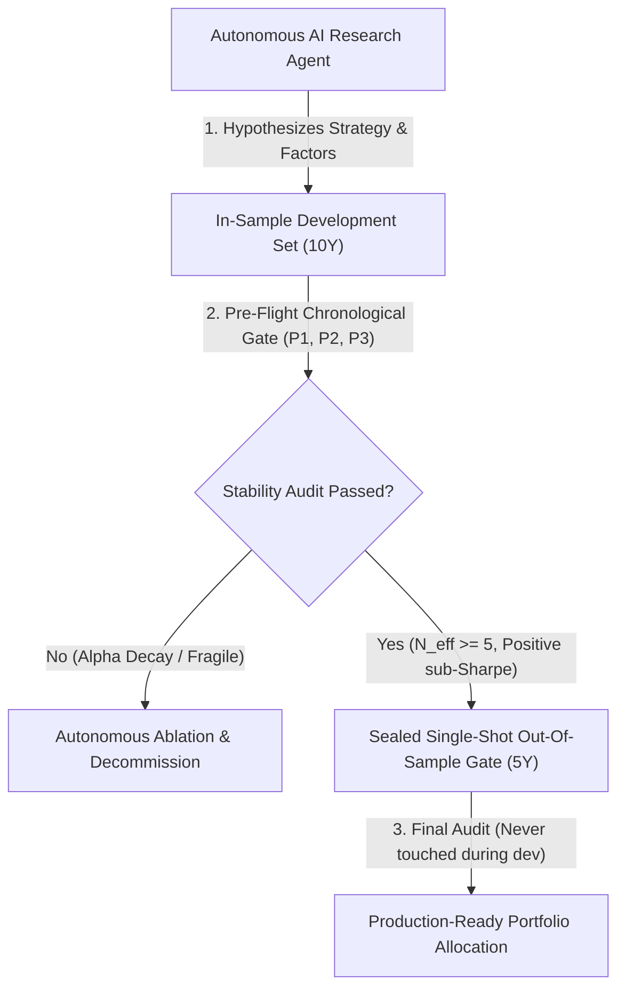

# Quantitative Portfolio & Alpha Research Engine

[](https://www.python.org/downloads/)
[](https://opensource.org/licenses/MIT)
[]()
[]()
[]()

An institutional-grade systematic quantitative research and portfolio backtesting framework. Designed to run **autonomous AI-agent research loops** that formulate, backtest, and validate systematic trading strategies under strict anti-overfitting protocols (single-shot Out-Of-Sample validation, chronological sub-period stability, and volatility targeting).

---

## 🎯 Architectural Overview & Agentic Research Workflow

In modern quantitative finance, the greatest risk is **p-hacking and backtest overfitting**. This repository implements an end-to-end quantitative framework where **AI research agents** interact with market datasets under strictly controlled cryptographic gates:



### Key Pillars
1. **Multi-Asset Volatility-Targeted Momentum (`portfolio/`):**
   * 15-year dataset across G10 FX majors and multi-asset instruments.
   * Evaluates Time-Series Momentum (TSMOM) vs. Inverse-Volatility Weighted Buy-and-Hold.
   * **Validated OOS Results (2020–2025):** Annualized Return **+17.58%**, Sharpe **+1.103**, Max Drawdown **26.84%** with Effective Number of Bets $N_{\text{eff}} = 5.53$.
2. **Tick/Intraday Microstructure Simulator (`simulation/`):**
   * Sub-minute (M1) execution engine with realistic bid/ask spread modeling, slippage, and session windows (e.g., London Open).
   * Strict gating: Chronological sub-period decomposition (P1: 2018–2020, P2: 2021–2023, P3: 2024–2026).
3. **Agentic Diagnostics & Ablation (`portfolio/tools/`):**
   * Autonomous diagnostic scripts to isolate alpha vs. beta, test window significance, and verify execution edge.

---

## 📊 Validated Benchmark Performance

Summary of portfolio research phases across the 15-year dataset (10Y In-Sample Development, 5Y Out-Of-Sample Validation):

| Architecture / Iteration | Status | In-Sample Sharpe | OOS Sharpe (2020–2025) | Annualized Return | Max DD | Key Takeaway |
| :--- | :--- | :---: | :---: | :---: | :---: | :--- |
| **v1.0 FX TSMOM** | Decommissioned | -0.130 | — | — | — | Rejected at In-Sample pre-flight gate. |
| **v2.0 Multi-Asset TSMOM** | Decommissioned | +0.451 | — | — | — | Failed sub-period stability check. |
| **v3.0 Passive Vol-Targeted** | **Production Validated** | **+0.588** | **+1.103** | **+17.58%** | **26.84%** | **Passed all 3 chronological gates and consumed sealed OOS.** |

---

## 📁 Repository Structure

```
quantitative-portfolio-engine/
├── portfolio/
│   ├── core/
│   │   ├── data_loader.py            # Automated multi-asset data pipelines & cleaning
│   │   ├── momentum_engine.py        # TSMOM factor calculations & portfolio rebalancing
│   │   └── multi_asset_engine.py     # Volatility-targeting, risk parity & weight allocation
│   └── tools/
│       ├── run_alpha_vs_beta_diags.py             # Factor decomposition diagnostics
│       ├── run_passive_portfolio_validation.py    # Complete OOS audit execution
│       ├── run_multi_asset_preflight.py           # Pre-flight gate stability checks
│       └── run_baseline_preflight.py              # In-sample baseline benchmarking
├── simulation/
│   ├── core/
│   │   ├── data_feeder.py            # Streamlined M1 candle & tick ingestion
│   │   ├── execution_engine.py       # Realistic order execution with slippage & spread
│   │   ├── metrics.py                # Pip-level expectancy, profit factor & drawdown
│   │   └── session_manager.py        # Institutional market session scheduling (London/NY)
│   └── strategy/
│       ├── base_strategy.py          # Abstract base class for quantitative agents
│       ├── london_orb_v2.py          # London Opening Range Breakout engine
│       ├── london_sweep_v3.py        # Liquidity sweep mean reversion model
│       └── london_bot_v1.py          # Multi-indicator trend-following baseline
├── data/
│   ├── fx_majors_daily_2010_2025.csv # 15-year daily OHLCV dataset
│   └── eurusd_m1_sample.csv          # Sample intraday M1 data for quickstart testing
├── docs/                             # Design rules, specifications, and version changelogs
├── requirements.txt                  # Python dependencies
└── README.md
```

---

## 🚀 Quickstart Guide

### 1. Installation
Clone the repository and install dependencies:
```bash
git clone https://github.com/YOUR_USERNAME/quantitative-portfolio-engine.git
cd quantitative-portfolio-engine
python -m venv .venv
# On Windows:
.venv\Scripts\activate
# On Linux/macOS:
source .venv/bin/activate

pip install -r requirements.txt
```

### 2. Run Autonomous Portfolio Validation
Run the complete out-of-sample portfolio validation script:
```bash
python portfolio/tools/run_passive_portfolio_validation.py
```
This performs:
- Volatility scaling across instruments ($N_{\text{eff}}$ calculation).
- 10-year rolling in-sample walk-forward evaluation.
- Sealed 5-year Out-Of-Sample (2020–2025) performance report.

### 3. Run Pre-flight Stability Diagnostics
To evaluate whether a new strategy meets institutional acceptance criteria:
```bash
python portfolio/tools/run_multi_asset_preflight.py
```

---

## 🧠 Role of AI Agents in this Framework

This project was engineered leveraging **agentic AI workflows**:
- **Strategy Code Synthesis:** Using LLM agents guided by strict YAML/markdown rule definitions ([design_rules_v1.md](file:///docs/design_rules_v1.md)).
- **Automated Bug Hunting & Invariance Testing:** Automated test suites verifying zero lookahead bias and deterministic execution.
- **Ablation Studies:** Autonomous scripts iterating through parameter spaces and systematically pruning non-robust factors without human confirmation bias.

---

## 📜 License
This project is licensed under the MIT License - see the LICENSE file for details.
